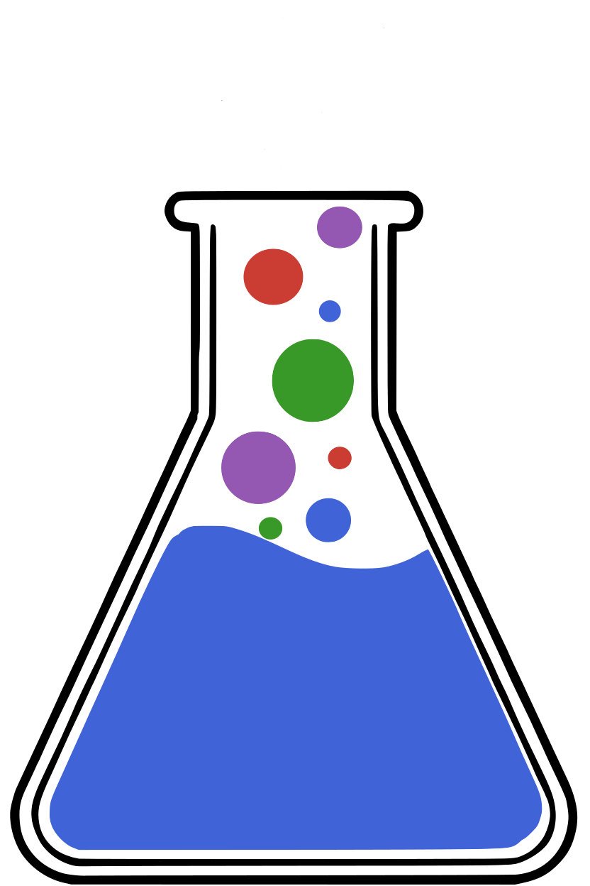

<p align="center">
  
</p>


# ChemistryLab

[](https://MicroPoroChemoMechanics.github.io/ChemistryLab.jl/stable/)
[](https://MicroPoroChemoMechanics.github.io/ChemistryLab.jl/dev/)

[](https://github.com/MicroPoroChemoMechanics/ChemistryLab.jl/actions/workflows/CI.yml)

[](https://github.com/MicroPoroChemoMechanics/ChemistryLab.jl/blob/main/LICENSE)
[](https://github.com/fredrikekre/Runic.jl)

[](https://doi.org/10.5281/zenodo.17756074)

`ChemistryLab.jl` handles chemical formulas, species and reactions as
first-class objects, reads thermodynamic data from ThermoFun and Cemdata, and
solves equilibrium by Gibbs-energy minimization. Kinetics and chemo-mechanical
coupling build on the same objects.

It grew out of work on low-carbon cementitious materials and aqueous solutions,
but its scope is not restricted to them: formula parsing, Unicode/Phreeqc
conversion, stoichiometric matrices, reaction algebra, activity models,
temperature sweeps and speciation diagrams are general.

It is written for work that has to be reproducible and scripted — aqueous
geochemistry, cement chemistry, and any problem where speciation, a database and
a solver have to be driven from code rather than from a dialog box.

## Features

- **Chemical formula handling**: Create, convert, and display formulas with charge management and Unicode/Phreeqc notation.
- **Chemical species management**: `Species` and `CemSpecies` types to represent solution and solid phase species; `with_class` to requalify a species without modifying the original.
- **Stoichiometric matrices**: Automatic construction of matrices for reaction and equilibrium analysis.
- **Database interoperability**: Import and merge ThermoFun (.json) and Cemdata (.dat) data; load solid solution definitions from a TOML file with `build_solid_solutions`.
- **Parsing tools**: Convert chemical notations, extract charges, calculate molar mass, and more.
- **Solid solutions**: Define ideal (`IdealSolidSolutionModel`) or non-ideal binary (`RedlichKisterModel`) mineral mixing phases via `SolidSolutionPhase`; end-members are automatically requalified at construction time.
- **Activity models**: Built-in aqueous activity models for equilibrium: `DiluteSolutionModel` (ideal), `HKFActivityModel` (extended Debye-Hückel B-dot), and `DaviesActivityModel`.
- **Chemical equilibrium**: Compute thermodynamic equilibrium compositions from initial states using Gibbs energy minimization (`equilibrate`, `ChemicalSystem`, `ChemicalState`).

## Installation

ChemistryLab.jl is registered in Julia's General registry.

In Pkg REPL mode (press `]` in the Julia REPL):

```julia-repl
pkg> add ChemistryLab
```

Or, equivalently, via the `Pkg` API:

```julia
using Pkg
Pkg.add("ChemistryLab")
```

### Optimization backend for equilibrium

Solving a thermodynamic equilibrium (`equilibrate`) requires an optimization
backend, loaded on demand through a package extension. Load **one** of:

```julia
using Optimization, OptimizationIpopt   # default backend (Ipopt), works out of the box
# or
using OptimaSolver                       # optional Julia-native interior-point backend
```

All backends are optional (`[weakdeps]`); parsing, species/system/state handling,
databases and thermodynamic data work without any of them.

## Example

Let's imagine we want to study the equilibrium of calcite in water.

$\text{CaCO}_3 \rightleftharpoons \text{Ca}^{2+} + {\text{CO}_3}^{2-}$

To do this, we can create a list of chemical species, retrieve the thermodynamic properties of these species from one of the databases integrated into ChemistryLab. We can then deduce the chemical species likely to appear in the reaction and calculate the associated stoichiometric matrix.

In this example, the database is [cemdata](https://www.empa.ch/web/s308/thermodynamic-data). The `.json` file is included in ChemistryLab but is a copy of a file which can be found in [ThermoHub]("https://github.com/thermohub").

```julia
using ChemistryLab
using DynamicQuantities

# `datapath` names a bundled database independently of the working directory
all_species = build_species(datapath("cemdata18-thermofun.json"))
```

Runnable versions of every example below live in [`scripts/`](scripts/README.md),
one file per topic; they run from any working directory, including straight from
an editor.

The chemical species likely to appear during calcite equilibrium in water are obtained in the following way:

```julia
species_calcite = speciation(all_species, split("Cal H2O@ CO2");
                             aggregate_state=[AS_AQUEOUS],
                             exclude_species=split("H2@ O2@ CH4@"))
dict_species_calcite = Dict(symbol(s) => s for s in species_calcite)
```

The output of `dict_species_calcite` reads:
```
Dict{String, Species} with 12 entries:
  "H+"        => H+ {H+} [H+ ◆ H⁺]
  "OH-"       => OH- {OH-} [OH- ◆ OH⁻]
  "CO2"       => CO2 {CO2  g} [CO2 ◆ CO₂]
  "Ca(HCO3)+" => Ca(HCO3)+ {CaHCO3+} [Ca(HCO3)+ ◆ Ca(HCO₃)⁺]
  "Cal"       => Cal {Calcite} [CaCO3 ◆ CaCO₃]
  "CaOH+"     => CaOH+ {CaOH+} [Ca(OH)+ ◆ Ca(OH)⁺]
  "H2O@"      => H2O@ {H2O  l} [H2O@ ◆ H₂O@]
  "Ca+2"      => Ca+2 {Ca+2} [Ca+2 ◆ Ca²⁺]
  "CO2@"      => CO2@ {CO2  aq} [CO2@ ◆ CO₂@]
  "HCO3-"     => HCO3- {HCO3-} [HCO3- ◆ HCO₃⁻]
  "CO3-2"     => CO3-2 {CO3-2} [CO3-2 ◆ CO₃²⁻]
  "Ca(CO3)@"  => Ca(CO3)@ {CaCO3  aq} [CaCO3@ ◆ CaCO₃@]
```

During species creation, ChemistryLab calculates the molar mass of the species. It also constructs thermodynamic functions (heat capacity, entropy, enthalpy, and Gibbs free energy of formation) as a function of temperature.

```julia
dict_species_calcite["Cal"]
```

```
Species{Int64}
           name: Calcite
         symbol: Cal
        formula: CaCO3 ◆ CaCO₃
          atoms: Ca => 1, C => 1, O => 3
         charge: 0
aggregate_state: AS_CRYSTAL
          class: SC_COMPONENT
     properties: M = 0.10008599996541243 kg mol⁻¹
                 Tref = 298.15 K
                 Pref = 100000.0 m⁻¹ kg s⁻²
                 Cp⁰ = 104.5163192749 + 0.02192415855825T + -2.59408e6 / (T^2) [m² kg s⁻² K⁻¹ mol⁻¹] ◆ T=298.15 K
                 ΔₐH⁰ = -1.2482415842895252e6 + 104.5163192749T + 2.59408e6 / T + 0.010962079279125(T^2) [m² kg s⁻² mol⁻¹] ◆ T=298.15 K    
                 S⁰ = -523.9438829693111 + 0.02192415855825T + 104.5163192749log(T) + 1.29704e6 / (T^2) [m² kg s⁻² K⁻¹ mol⁻¹] ◆ T=298.15 K 
                 ΔₐG⁰ = -1.1423813547027335e6 + 628.460202244211T + 1.29704e6 / T - 0.010962079279125(T^2) - 104.5163192749T*log(T) [m² kg s⁻² mol⁻¹] ◆ T=298.15 K
                 V⁰ = 3.6933999061584004e-5 [m³ mol⁻¹]
                 Cp⁰_Tref = 81.87109375 m² kg s⁻² K⁻¹ mol⁻¹
                 ΔₐH⁰_Tref = -1.207405e6 m² kg s⁻² mol⁻¹
                 S⁰_Tref = 92.675598144531 m² kg s⁻² K⁻¹ mol⁻¹
                 ΔₐG⁰_Tref = -1.129176e6 m² kg s⁻² mol⁻¹
                 V⁰_Tref = 3.6933999061584004e-5 m³ mol⁻¹

```

The evolution of thermodynamic properties as a function of temperature, such as heat capacity, can thus be easily plotted.

```julia
using Plots

p1 = plot(xlabel="Temperature [K]", ylabel="Cp⁰ [J/mol/K]", title="Heat capacity of calcite \nas a function of temperature")
plot!(p1, θ -> dict_species_calcite["Cal"].Cp⁰(T = 273.15+θ), 0:0.1:100, label="Cp⁰")
```


Obtaining stoichiometric matrices requires the choice of a species-independent basis.

```julia
primaries = [dict_species_calcite[s] for s in split("H2O@ H+ CO3-2 Ca+2")]
SM = StoichMatrix(values(dict_species_calcite), primaries)
```
```
┌───────┬────┬─────┬─────┬───────────┬─────┬───────┬──────┬──────┬──────┬───────┬───────┬──────────┐
│       │ H+ │ OH- │ CO2 │ Ca(HCO3)+ │ Cal │ CaOH+ │ H2O@ │ Ca+2 │ CO2@ │ HCO3- │ CO3-2 │ Ca(CO3)@ │
├───────┼────┼─────┼─────┼───────────┼─────┼───────┼──────┼──────┼──────┼───────┼───────┼──────────┤
│  H2O@ │    │   1 │  -1 │           │     │     1 │    1 │      │   -1 │       │       │          │
│    H+ │  1 │  -1 │   2 │         1 │     │    -1 │      │      │    2 │     1 │       │          │
│ CO3-2 │    │     │   1 │         1 │   1 │       │      │      │    1 │     1 │     1 │        1 │
│  Ca+2 │    │     │     │         1 │   1 │     1 │      │    1 │      │       │       │        1 │
└───────┴────┴─────┴─────┴───────────┴─────┴───────┴──────┴──────┴──────┴───────┴───────┴──────────┘
```

These stoichiometric matrices thus allow us to write the chemical reactions at work.

```julia
list_reactions = reactions(SM)
dict_reactions_calcite = Dict(r.symbol => r for r in list_reactions)
```

Again, when constructing the reactions, the thermodynamic properties of the reactions as a function of temperature are deduced. It is thus possible to see, for example, the expression for the solubility product of calcite for the reaction under study and to plot its evolution.

```julia
dict_reactions_calcite["Cal"].logK⁰
```

```
SymbolicFunc:
  Expression: (-1.29704e6 + 125345.63212888106T - 2666.9195440882527(T^2) + 424.77184295654104(T^2)*log(T) + 0.010962079279125T*(T^2)) / (19.144757680815896(T^2)) [m² kg s⁻² mol⁻¹]
  References: T=298.15 K
  Variables: T

```

```julia
p1 = plot(xlabel="Temperature [K]", ylabel="pKs", title="Solubility product (pKs) of calcite \nas a function of temperature")
plot!(p1, θ -> dict_reactions_calcite["Cal"].logK⁰(T = 273.15+θ), 0:0.1:100, label="pKs")
```


### Chemical equilibrium

Once the chemical system is defined, the equilibrium composition can be computed directly from an initial state. A `ChemicalSystem` groups all species and pre-computes the conservation matrix; a `ChemicalState` holds the mole amounts, temperature, and pressure.

```julia
# Build the chemical system from the species returned by speciation
cs = ChemicalSystem(collect(values(dict_species_calcite)))

# Define an initial state: dissolve 1e-3 mol of calcite in 1 kg of water (≈ 55.5 mol) at 25 °C
state0 = ChemicalState(cs; T = 298.15u"K", P = 1u"bar")
set_quantity!(state0, "H2O@", 55.5u"mol")
set_quantity!(state0, "Cal",  1e-3u"mol")
set_quantity!(state0, "H+",   1e-7u"mol")
set_quantity!(state0, "OH-",  1e-7u"mol")

# Compute thermodynamic equilibrium (Gibbs energy minimization)
state_eq = equilibrate(state0)
```

Key results can then be inspected directly:

```julia
pH(state_eq)          # equilibrium pH
moles(state_eq)       # mole amounts by phase (liquid / solid / gas / total)
moles(state_eq, "Ca+2")  # moles of a specific species
```

The `equilibrate` function uses `IpoptOptimizer` under the hood (via Optimization.jl) and accepts optional keyword arguments to tune the solver (`abstol`, `reltol`, `variable_space`, …), as well as an `model` keyword for the aqueous activity model:

```julia
state_eq = equilibrate(state0; model = HKFActivityModel())   # extended Debye-Hückel
state_eq = equilibrate(state0; model = DaviesActivityModel()) # Davies equation
```

#### Solid solutions

Mineral solid solutions (e.g. C-S-H, AFm) are modeled by grouping end-member species into a `SolidSolutionPhase`. Database species with `SC_COMPONENT` class can be passed directly — requalification to `SC_SSENDMEMBER` is handled automatically:

```julia
substances = build_species(datapath("cemdata18-thermofun.json"))
dict = Dict(symbol(s) => s for s in substances)

# Ideal solid solution (any number of end-members)
cshq = SolidSolutionPhase("CSHQ", [dict["CSHQ-TobD"], dict["CSHQ-TobH"],
                                    dict["CSHQ-JenH"], dict["CSHQ-JenD"]])

# Non-ideal binary: Redlich-Kister (parameters in J/mol)
afm = SolidSolutionPhase("AFm", [dict["Ms"], dict["Mc"]];
          model = RedlichKisterModel(a0 = 3000.0, a1 = 500.0))

# Or load all solid solution phases at once from a TOML file
ss_phases = build_solid_solutions(datapath("solid_solutions.toml"), dict)

cs = ChemicalSystem(species_list, primaries; solid_solutions = ss_phases)
```

A pre-built `data/solid_solutions.toml` (CSHQ, AFm, Hydrogarnet, Ettringite_ss, Hydrotalcite) is shipped with ChemistryLab for use with the cemdata18 database.

#### Scaling and normalization

A `ChemicalState` supports scalar multiplication and in-place rescaling to a target total:

```julia
state2 = state_eq * 2.0         # double all amounts (non-mutating)
state_h = state_eq / 1000       # millimolar scale  (non-mutating)

rescale!(state_eq, 1.0u"mol")   # total moles  → 1 mol  (in-place)
rescale!(state_eq, 1.0u"kg")    # total mass   → 1 kg   (in-place)
rescale!(state_eq, 1.0u"m^3")   # total volume → 1 m³   (in-place)
```

## Usage

See the [documentation and tutorials](https://MicroPoroChemoMechanics.github.io/ChemistryLab.jl) for examples on formula creation, species management, reaction parsing, and database merging.

## License

ChemistryLab.jl is licensed under the **GNU Lesser General Public License,
version 2.1 or (at your option) any later version** (LGPL-2.1-or-later).

Parts of the thermodynamics and kinetics subsystems are Julia ports adapted
from the [Reaktoro](https://github.com/reaktoro/reaktoro) C++ library
(copyright © Allan Leal, LGPL-2.1-or-later):

- the HKF standard thermodynamic model for aqueous solutes and the water
  property functions (HGK 1984, Johnson-Norton 1991, Shock et al. 1992
  g-function);
- the Arrhenius rate constant, the saturation-ratio formulation, and the
  Palandri-Kharaka / transition-state theory mineral rate factories
  (`transition_state`, `first_order_rate`).

The remainder of the package — chemical formula / species /
stoichiometric-matrix infrastructure, equilibrium solver layer, database
readers, `KineticsProblem` / `KineticsSolver` architecture, Parrot-Killoh
cement hydration model, calorimetry — is original work copyright
© Jean-François Barthélémy and Anthony Soive (Cerema, UMR MCD).

See [`LICENSE`](LICENSE) for the full notice and
[`COPYING.LESSER`](COPYING.LESSER) for the full LGPL-2.1 text.

**Practical note for downstream users.** The LGPL permits `using ChemistryLab`
from Julia code of **any** license (MIT, Apache-2.0, proprietary). The
copyleft applies only to modifications of ChemistryLab.jl itself, which must
remain LGPL.

## Citation

[](https://doi.org/10.5281/zenodo.17756074)

See [CITATION.cff](CITATION.cff) for citation details.

**BibTeX entry:**

```bibtex
@software{chemistrylab_jl,
  author = {Barth{\'e}l{\'e}my, Jean-Fran{\c{c}}ois and Soive, Anthony},
  title  = {{ChemistryLab.jl}: Numerical laboratory for computational chemistry},
  doi    = {10.5281/zenodo.17756074},
  url    = {https://github.com/MicroPoroChemoMechanics/ChemistryLab.jl}
}
```

## Credits and Acknowledgements

Developed by [Jean-François Barthélémy](https://github.com/jfbarthelemy) and [Anthony Soive](https://github.com/anthonysoive), both researchers at [Cerema](https://www.cerema.fr/en) in the research team [UMR MCD](https://mcd.univ-gustave-eiffel.fr/).

Parts of the codebase were developed with the support of [Claude Code](https://claude.ai/code) (Anthropic) as an AI pair-programming assistant.
