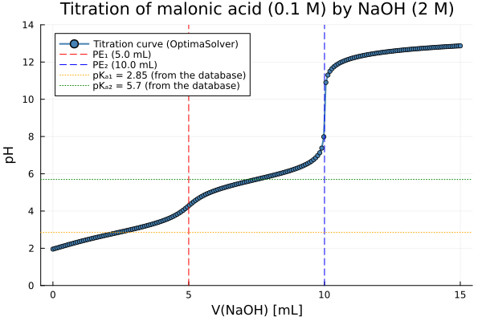

# [Titration of Malonic Acid by NaOH](@id sec-titration-malonic)

This example simulates the **potentiometric titration** of malonic acid (H₂A, a diprotic weak acid)
by sodium hydroxide (NaOH, a strong base). Both dissociation constants are **derived from the
database**, not tabulated.

!!! note "These species are malonate, not maleate"
    This page was titled "maleic acid" and drew maleic acid's tabulated constants
    (pKₐ₁ = 1.92, pKₐ₂ = 6.27) over a curve computed from malonate data — so the two dotted
    lines crossed the curve at neither half-equivalence point, which was visible in the
    published figure. SLOP98 names the three species `MALONIC-ACID,AQ`, `H-MALONATE,AQ` and
    `MALONATE,AQ`, and their formula carries **three** carbons: malonic acid is HOOC–CH₂–COOH
    (propanedioic acid, C₃H₄O₄), whereas maleic acid is the *cis*-butenedioic acid C₄H₄O₄.
    Neither maleic nor fumaric acid is present in SLOP98. The constants derived below agree
    with the accepted values for **malonic** acid to 0.02.

---

## System setup

The species are distributed across two SLOP98 databases:
the inorganic database provides H₂O, H⁺, OH⁻ and Na⁺;
the organic database provides malonic acid and its conjugate bases.

| Symbol | Species | Phase |
|:-------|:--------|:------|
| `MalH2@` | H₂A — malonic acid | aqueous solute |
| `MalH-`  | HA⁻ — hydrogen malonate | aqueous solute |
| `Mal-2`  | A²⁻ — malonate | aqueous solute |
| `Na+`    | Na⁺ | aqueous solute |
| `H+`     | H⁺ | aqueous solute |
| `OH-`    | OH⁻ | aqueous solute |
| `H2O@`   | H₂O | aqueous solvent |

```@example titration_setup
using ChemistryLab
using DynamicQuantities

substances_inorg = build_species(datapath("slop98-inorganic-thermofun.json"))
substances_org   = build_species(datapath("slop98-organic-thermofun.json"))

dict_all_species = merge(Dict(symbol(s) => s for s in substances_inorg), Dict(symbol(s) => s for s in substances_org))
species = [dict_all_species[s] for s in split("H2O@ Na+ NaOH@ H+ OH- MalH2@ MalH- Mal-2")]

cs = ChemicalSystem(species, ["H2O@", "H+", "Mal-2", "Na+", "Zz"])
nothing # hide
```

## The two constants come from the database

Both are computed from the standard Gibbs energies of formation the database ships. The
literature values are printed for comparison and **never enter the calculation**.

```@example titration_setup
R  = ustrip(Constants.R)
T  = 298.15   # K
RT = R * T

sp = Dict(symbol(s) => s for s in cs.species)

# MalH2@ ⇌ MalH⁻ + H⁺
Ka1  = exp(-(sp["MalH-"].ΔₐG⁰(T = T) + sp["H+"].ΔₐG⁰(T = T) - sp["MalH2@"].ΔₐG⁰(T = T)) / RT)
pKa1 = -log10(Ka1)

# MalH⁻ ⇌ Mal²⁻ + H⁺
Ka2  = exp(-(sp["Mal-2"].ΔₐG⁰(T = T) + sp["H+"].ΔₐG⁰(T = T) - sp["MalH-"].ΔₐG⁰(T = T)) / RT)
pKa2 = -log10(Ka2)

println("pKa1 (MalH2@ / MalH⁻) = ", round(pKa1, digits = 2), "   (lit. malonic 2.83)")
println("pKa2 (MalH⁻  / Mal²⁻) = ", round(pKa2, digits = 2), "   (lit. malonic 5.69)")
println("Δ pKa                 = ", round(pKa2 - pKa1, digits = 2))
```

Build the [`EquilibriumSolver`](@ref) once — it is reused at every titration point:

```@example titration_setup
using Optimization, OptimizationIpopt

solver = EquilibriumSolver(
    cs,
    DiluteSolutionModel(),
    IpoptOptimizer(
        mu_strategy = "adaptive",
    );
    variable_space = Val(:linear),
    abstol  = 1e-8,
    reltol  = 1e-8,
    maxiters = 100,
    verbose = false,
)
nothing # hide
```

---

## Running the titration

At each titration point the total composition is reset from scratch and the equilibrium is
recomputed. The conservation constraint (total moles of each component) is enforced by the solver.

```@example titration_setup
V_acid = 100e-3   # volume of acid solution, L
c_acid = 0.1      # malonic acid concentration, mol/L
c_base = 2.0      # NaOH concentration, mol/L
n_H2A  = V_acid * c_acid   # total moles of H₂A = 10 mmol

ρ_water = 1.0   # kg/L

V_eq1 = n_H2A / c_base * 1e3       # first equivalence point,  5 mL
V_eq2 = 2 * n_H2A / c_base * 1e3   # second equivalence point, 10 mL

volumes_NaOH = collect(range(0, 15; length = 101))   # mL, step 0.15 mL
pH_vals = Float64[]

s = ChemicalState(cs)
for V_mL in volumes_NaOH
    V_NaOH  = V_mL * 1e-3            # L
    n_NaOH  = c_base * V_NaOH        # mol of NaOH (= mol of Na⁺ added)
    V_total = V_acid + V_NaOH        # total volume, L

    set_quantity!(s, "MalH2@", n_H2A * u"mol")
    set_quantity!(s, "NaOH@", n_NaOH * u"mol")
    set_quantity!(s, "H2O@",  ρ_water * V_total * u"kg")

    V_liq = volume(s).liquid
    set_quantity!(s, "H+",  1e-7u"mol/L" * V_liq)   # pH-neutral seed
    set_quantity!(s, "OH-", 1e-7u"mol/L" * V_liq)

    s_eq = solve(solver, s)
    push!(pH_vals, pH(s_eq))
end

# Indices are looked up from the volume, never hard-coded.
at(V) = argmin(abs.(volumes_NaOH .- V))

for (V, what) in ((0.0, "pure acid"), (V_eq1 / 2, "½ PE₁"), (V_eq1, "PE₁"),
                  (V_eq1 + V_eq1 / 2, "½ PE₂"), (V_eq2, "PE₂"), (15.0, "excess NaOH"))
    i = at(V)
    println("pH at V = ", lpad(round(volumes_NaOH[i], digits = 2), 5), " mL  ",
            rpad("($what)", 15), " : ", round(pH_vals[i], digits = 2))
end
```

The two half-equivalence points return the two constants, which is the Henderson–Hasselbalch
condition and the internal check the previous version of this page failed.

---

## Titration curve

```julia
using Plots

p = plot(
    volumes_NaOH, pH_vals;
    xlabel     = "V(NaOH) (mL)",
    ylabel     = "pH",
    label      = "Titration curve",
    linewidth  = 2,
    marker     = :circle,
    markersize = 3,
    color      = :steelblue,
    title      = "Titration of malonic acid (0.1 M) by NaOH (2 M)",
    ylims      = (0, 14),
    legend     = :topleft,
)
vline!(p, [V_eq1]; linestyle = :dash, color = :red,    label = "PE₁ ($(round(V_eq1, digits = 1)) mL)")
vline!(p, [V_eq2]; linestyle = :dash, color = :blue,   label = "PE₂ ($(round(V_eq2, digits = 1)) mL)")
hline!(p, [pKa1];  linestyle = :dot,  color = :orange, label = "pKₐ₁ = $(round(pKa1, digits = 2)) (from the database)")
hline!(p, [pKa2];  linestyle = :dot,  color = :green,  label = "pKₐ₂ = $(round(pKa2, digits = 2)) (from the database)")
```



---

## Analysis

| Zone | V(NaOH) | Dominant species | pH |
|:-----|:--------|:-----------------|:---|
| Initial state | 0 mL | H₂A | Low, controlled by pKₐ₁ |
| First buffer | 0–5 mL | H₂A / HA⁻ | ≈ pKₐ₁ at V = 2.5 mL |
| First equivalence point (PE₁) | 5 mL | HA⁻ | First inflection |
| Second buffer | 5–10 mL | HA⁻ / A²⁻ | ≈ pKₐ₂ at V = 7.5 mL |
| Second equivalence point (PE₂) | 10 mL | A²⁻ | Second inflection |
| Excess base | > 10 mL | A²⁻ + OH⁻ | Controlled by excess NaOH |

- **V = 0 mL** — the pH is low, determined mainly by the first dissociation.
- **V = 2.5 mL (half-equivalence 1)** — pH ≈ pKₐ₁, the Henderson–Hasselbalch condition.
- **V = 5 mL (PE₁)** — the first proton is neutralized; the dominant species goes from H₂A to HA⁻.
- **5 mL < V < 10 mL** — the HA⁻/A²⁻ couple buffers; at V = 7.5 mL, pH ≈ pKₐ₂.
- **V = 10 mL (PE₂)** — the second proton is neutralized; the dominant species is A²⁻.
- **V > 10 mL** — the pH rises steeply, controlled by free OH⁻ from the excess NaOH.

!!! note "Δ pKₐ and how well the first equivalence point resolves"
    The two constants of malonic acid are separated by Δ pKₐ ≈ 2.85. That is enough for two
    distinguishable buffer regions, but **not** enough for a sharp first equivalence point: at
    V = 5 mL the curve shows a gentle inflection rather than a jump, and only the second
    equivalence point rises steeply. An earlier version of this page claimed
    "Δ pKₐ ≈ 4.35 … two clearly resolved inflection points" — that figure belongs to maleic
    acid, and the claim does not survive looking at the curve it accompanied.
